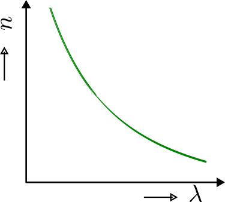
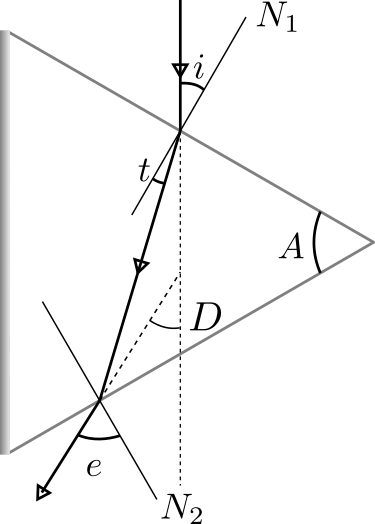

# Theory

## Cauchy's equation
The refractive index $(n)$ of an optically transparent material depends on the wavelength of the light. The dependence can be written as

$$n = 1 + A \left( 1 + \frac{B}{\lambda^2} \right)$$

or,
$$n - 1  =  A + \frac{AB}{\lambda^2}$$

where $A$ is known as coefficient of refraction and $B$ is known as coefficient of dispersion.

  
Figure 2.1-1: Cauchy's Dispersion Graph

## Snell's formula
When the angle of incidence becomes equal to the angle of emergence, i.e. $ (i = e) $, deviation becomes minimum $ D \rightarrow D_{min} $. Also satisfying $i = \frac{A + D_{min}}{2}$ and $t = \frac{A}{2}$.

If angle of the prism $(A)$ is known, then by knowing angle of minimum deviation $(D_{min})$, the refractive index $(n)$ can be found by Snell's formula,

$$n = \frac{sin\left(\frac{A_p+D_{min}}{2}\right)}{sin\left(\frac{A_p}{2}\right)}$$

Where  $A_p$ is the angle of prism and $D_{min}$ is the angle of minimum deviation. 

  
Figure 2.1-2: Ray diagram

## Dispersive power

$$\omega = \frac{n_B - n_R}{n_Y - 1}$$