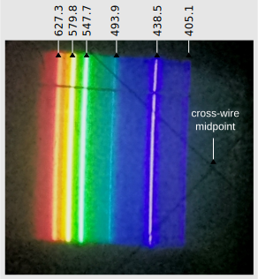
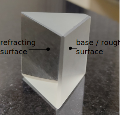

# Apparatus

## Light Source
The Mercury light bulb is placed inside a black box with a small `vertical slice opening`.

  
Figure 2.2-1: Spectrum of the mercury light when viewed from glass prism.

## Prism Glass
As the name suggests, it is made of glass with two `refracting surfaces` where light can be transmitted and one `rough surface`` where light gets scattered or absorbed.

  
Figure 2.2-2: Prism glass

## Spectrometer
A spectrometer consists of four components: collimator, telescope, prism table, and vernier table.

  
Figure 2.2-2: Spectrometer

## Additional Components
Water label, small rod for tightening spectrometer parts.