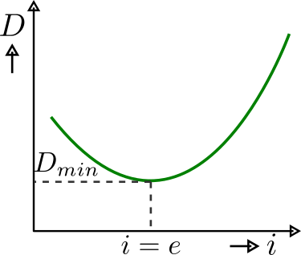
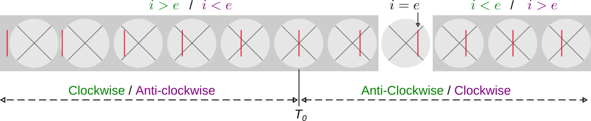

# Flowchart
This is the main flowchart that you must follow. 

- Level the telescope, collimator, and prism table by a spirit level.
- Check the direct white light from the telescope, adjust the slit width placed in front of the collimator so that the vertical line becomes narrower, then focus by adjusting the telescope's eye-piece knob. You can also use the collimator adjusting knob for focusing when telescope eye-piece adjustment is insufficient.
- Place the prism such that it's one refracting surface facing the light coming from the collimator and another surface facing the telescope or you. Don't put the prism such that the prism's base blocks the light path.
- First, try to detect the visible spectrum from your naked eye, then bring the telescope to that point and try to see from the telescope. If the image gets blurred, make eye-piece adjustments for a sharper image.
 - Now, the telescope is not at the same place when you tried to get white vertical line without placing the prism on the prism table, Right? So that means light gets deviated when you put the prism glass. Now you are at some unknown deviation point. We can't proceed with this angle of deviation; we need **angle of minimum deviation $(D_{min})$**. Then, only we can apply **Snell's equation** to get the refractive index for different colors of light.
 - We need to make the angle of incidence equal to the angle of emergent, i.e., $(i = e)$ to get the minimum deviation position. So, we will rotate the prism to make $(i = e)$. Here, we will not rotate the prism; instead, we will rotate the prism table for smooth movement.
  
      
    Figure 3.3-1: Angle of deviation with angle of incidence.

 - **Find minimum deviation point**:For the timing, we will not disturb the telescope and only observe through it by rotating the prism table clockwise and anti-clockwise. In clockwise or anti-clockwise direction (we can't predict which direction we can get the minimum; it all depends on prism orientation), all the lines will be out of the field and will not be any return of the spectrum. So, that means that direction will not have the minimum deviation point. Now, we will rotate anti-clockwise (if previously was clockwise) or clockwise (if previously was anit-clockwise); at this time, all the spectrum will return to the telescope view, and we will keep rotating in that direction. At some point, movement of the spectrum will turn its directions, i.e., if it was going *left to right* then at that point, it will turn back and will move opposite means *right to left* (for *right to left* it will turn from *left to right*). 
 If you observe this interesting turning of spectrum movement, then you are almost done finding the minimum deviation. So to set the prism at $(i=e)$ you have to **stop rotating the prism table** when the turn occurs.
    
      
    Figure 3.3-2: Telescope view with changing the prism orientation.
 - Now, you will see the spectrum has slightly shifted from the telescope view, either left or right. Since we will start taking reading from *red*, we will move the telescope cross-wire on the red line. You can use *fine adjustment* to move the telescope position slowly; in that case, you need to lock the telescope by the knob.

    **NB**: If you are wearing blue light protected glass, you can't see the blue line properly. So, to see the blue line of the spectrum, you need to take out your glass and see from your eye. You can get a blurred image since you are not using glass, but don't worry, we have eye-piece try to adjust that to get a sharp image.