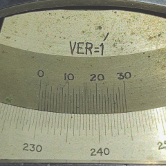
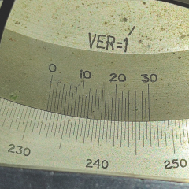

# Experimental Data

Angle of prism $(A_p) = 60^{o}$ `(given)`

## Calculation of least count $(l.c)$ or vernier constant $(v.c)$

From below image of vernier scale you can see that length of `30 lines of vernier scale` matches with the lenght of `29 lines of main scale`

  
Figure 2.4-1: vernier scale

$ 30 \enspace vernier \enspace  division \enspace (v.d) = 29 \enspace  scale \enspace  division (s.d)$

$or, \enspace 1 \enspace v.d = 29/30 \enspace s.d$

$so,\enspace v.c = 1 \enspace s.d - 1 \enspace v.d = (1 - 29/30) \enspace s.d = 1/30 \enspace s.d = 1/30 \times 30^{'} = 1^{'}$

So, least count $(l.c) \enspace or \enspace (v.c) = 1^{'}$.

## How to take reading
Vernier reading $0$ is your reference point. First determine at what point vernier $0$ cross the main scale reading. Then you will look for the verner reading and that is the reading where a particular line from vernier scale perfectly coincides with any of the main scale reading. Let's see an example below

  
Figure 2.4-2: Reading at some deviation point

For this case $M.S.R = 232^{o}$ and $V.S.R = 20$. So, total reading $M.S.R + V.S.R \times l.c  = 232^{o} + 20 \times 1^{'} = 232^{o}20^{'}$

## Table - I
Measurement of anlge of minimu deviation

| Sr. No.  | $\lambda$ $nm$ |      with prism $(D)$       | without prism $(D_0)$ | Angle of minium deviation $(D_{min} = D - D_0)$ |
| :------: | :-----------------------: | :-------------------------------: | :-------------------------: | :----------------------------------------------------: |
|     1    |        627.3              |      $M.S.R + V.S.R \times l.c$   |             ...             |                           ...                          | 

**NB:**  With prism reading $(D)$ either can increase or decrease depending on your telescope orientation, but the angle of minimum deviation $(D_{min})$ should always **increase** from red to violet.

## Table - II
Calculation of refractive index

| Sr. No.  | $\lambda$ $nm$ | $1/\lambda^2$ $nm^{-2}$ | $n = \frac{sin\left(\frac{A_p+D}{2}\right)}{sin\left(\frac{A_p}{2}\right)}$ | $n-1$ |
| :------: | :-----------------------: | :---------------------------------: | :-------------------------------------------------------------------------------: | :---------: |
|    1     |            627.3          |       $2.54 \times 10^{-6}$         |                                         ...                                       |      ...    |

**NB:** Calculate the values for atleast three decimal places.

## Graph plotting
Recall the Cauchy's equation,
$$n - 1  =  A + \frac{AB}{\lambda^2}$$

we will plot $n-1 \enspace vs \enspace 1/\lambda^2$ graph, i.e it will be a straight line $(y=mx+c)$ where $n-1 \rightarrow y$, $1/\lambda^2 \rightarrow x$, $A \rightarrow C$ and $AB \rightarrow m$.

Some suggestions for plotting a proper graph

 - You should utilize all the space in your graph. for x-axis: start from $2.5 \times 10^{-6}$ then after 20 small squares mark $3.0 \times 10^{-6}$ and so on. Your scale division along x axis will become $sd_x = 0.025\times10^{-6}$ . It would be best to take care of your *y-axis* because it differs from each group and depends on how good your data points are.
 - You should draw a best-fitted graph; the criteria are it should pass through the centroid, and the curve to data points distance should be minimal.
 - Write the graph's title, and remember to label the axes.
 - Draw a bigger triangle for slope calculations, label the triangle vertices by *P*, *Q*, and *R*, and calculate *PQ* and *QR* length by counting how many small lines it covers multiplied by scale division along that axis.

 ## Calculate $A$, $B$ and $\omega$
  Since we have started *x-axis* from $0.025\times10^{-6}$ not from $0$, so we will not have intercept at $x = 0$ point. But we can calculate the intercept $A$ by putting the centroid value $(x_c = \frac{\sum_i^6 1/\lambda_i^2}{6}, y_c = \frac{\sum_i^6 n_i -1}{6})$ and  and slope $(m)$ [from graph] in the straight line equation.

$$A = C =   y_c - mx_c$$

and, once you got $A$ you can calculte 

$$B = \frac{m}{A}$$

for, $\omega$ use the expression and put the refractive index values from **Table - II**.